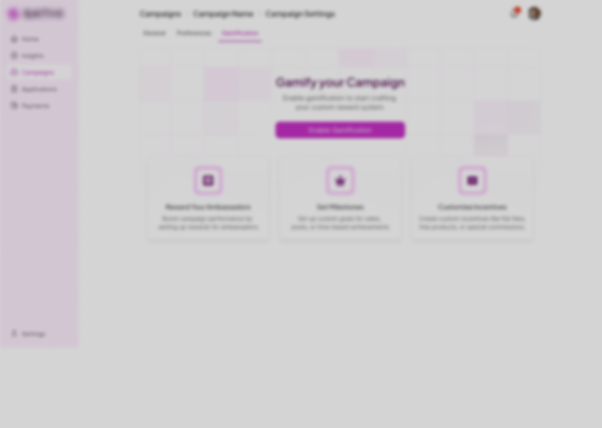

I first used shadcn to intialize the project and add the required components by going through the screen.
Then I started looking for things that are missing in design and made notes of them.

- Error state on fiedls were also missing on input/select components?
- Same with loading on input/select components??
- use sm,xs,lg for profile images on navbar
- The whole appsite is built around desktop size, so I need to make it responsive as well. Most users would be using mobile devices. Is this only for assignment or they have built their own app as well for desktop first and mobile later ? If that's the case then...

2. Started thinking about the product. Right now it is in english only but we should test other markets as well ? What's one thing that we can do to make it more accessible to other markets? Enter language selector a.k.a internationalization (i18n). I setup the code for it but didn't implement it yet.

3. Then created layout for the app and started implementing the components page by page.(Do note I'm not overly aggresive on putting the right colors and fonts, just to get the layout right)

4. When landing page was layed out. I went through the rest of the pages and implemented them.

- 

5. Now I'm working on implementing design system because 90% of the components are dialog and landing page.

6. I'm also working on implementing the design system in the app.

7. I implemented the raw funtionality. All the inputs and errors work.

8. Now back to making it pixel perfect.
